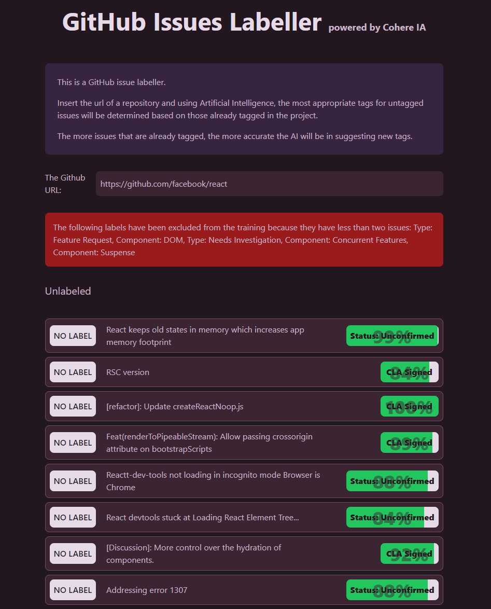

# GitHub Issues Labeller

You can test a ** [demo here](https://github-issues-labeller.dpuentel.com/) **.

## 🚀 Project Description

This is a GitHub issue labeller.

Insert the url of a repository and using Artificial Intelligence, the most appropriate tags for untagged issues will be determined based on those already tagged in the project.

The more issues that are already tagged, the more accurate the AI will be in suggesting new tags.

## 🧑‍💻 Project Tech Stack

### 🚀 [Astro](https://astro.build/)

Astro is the web framework that is used to build the project. It's fast, lightweight and make life easier.

### ⚛️ [React](https://reactjs.org/)

React is used to build some UI components.

### 🤖 [CoHere](https://cohere.ai/)

CoHere is an API that uses Artificial Intelligence to make predictions. Here is used to predict the labels for a GitHub issues not labeled.

### 📄[GitHub API](https://docs.github.com/en/rest)

The GitHub API is used to get the issues of a repository.

### 🎨 [TailwindCSS](https://tailwindcss.com/)

Tailwind CSS to fast style and build custom designs.

### 📦 [Dinahosting VPS](https://www.dinahosting.com/)

The [demo](https://github-issues-labeller.dpuentel.com/) is deployed to a VPS from Dinahosting using a GitHub Action.
